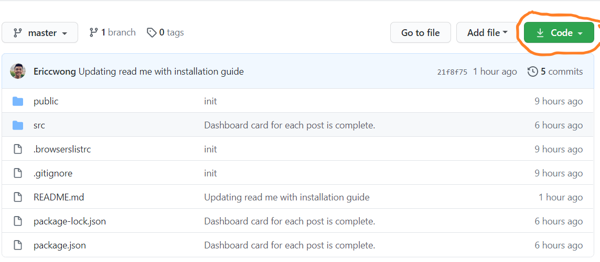
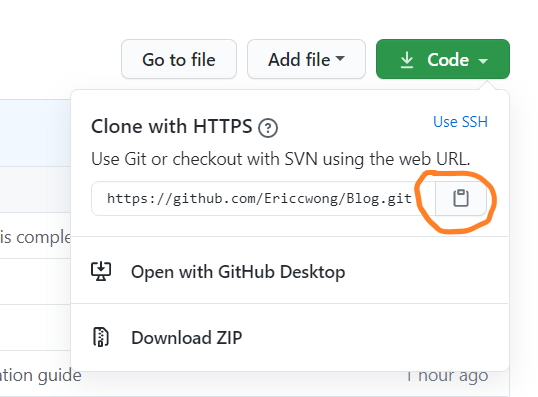

# Blog

Keeping track of my daily life has been harder and harder each day. With the world being turned upside down with all that is happening, I needed a way to log what has been going on. That is why I decided to create a blog! I will be blogging just about everything mostly about coding, adventures, or something that happened and I just wanted to share with everyone. Hopefully you would enjoy my wacky adventures as much as I do. See you around!

## Technology used

## Project setup

### Software Prerequisites:

<ol>
<li> Command-line of your choice e.g. Windows Command-line or Gitbash, or Apple's Terminal.
<li> An code editor or Integrated development environment (IDE) of your choice. I recommend <a href="https://code.visualstudio.com/">Visual Studio Code</a>.
<li> Once those are installed, you are ready to move on!
</ol>

### Cloning the repo!

<ol>
<li> Visit the <a href="https://github.com/Ericcwong/Blog"> repo.</a>
<li> Click on the green code button 
 

<li> Copy the link by clicking one the clipboard icon.
 

<li> With the code copied in your clipboard, go to your command-line and type in <b>git clone</b>without hitting enter paste in the link. (Quick tip: command-line is control insert to paste, not control v) It should look something like this: git clone https://github.com/Ericcwong/Blog.
<li> Now that you have the repo cloned to your local machine. Now it is time to open it and run it!
<li> Type in cd (change directory) to the repo's name in this case blog and hit enter.
<li> Once you are in, type in code . and that should open up Visual Studio Code if you have it installed.
<li> You are almost there to start the project! On the top left hand where it says file, edit and so on. Click on Terminal and click on new terminal.
<li> Type in npm install that would install all the requirements needed for this project
<li> Lastly to start the project type in npm run dev and it should popup with http://localhost:8080/
<li> Click on that link and you are ready to test out the application locally on your machine!
</ol>
